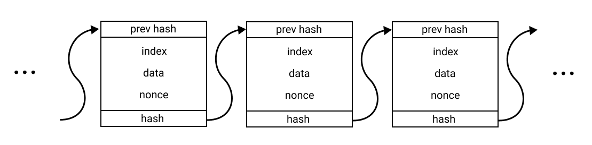
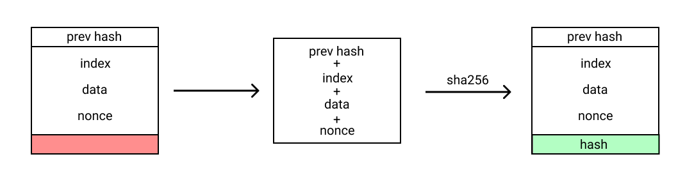
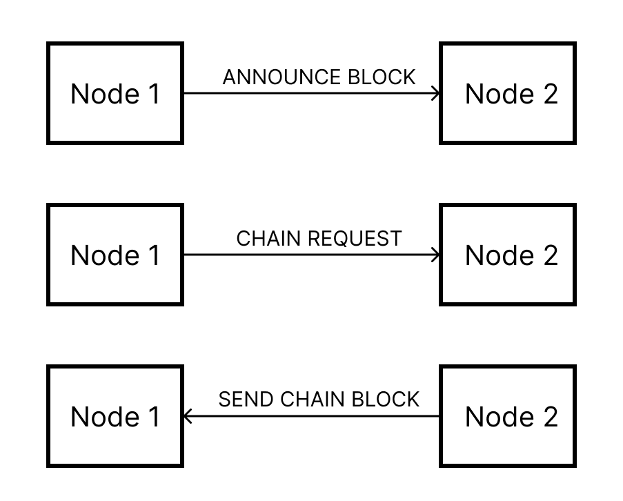
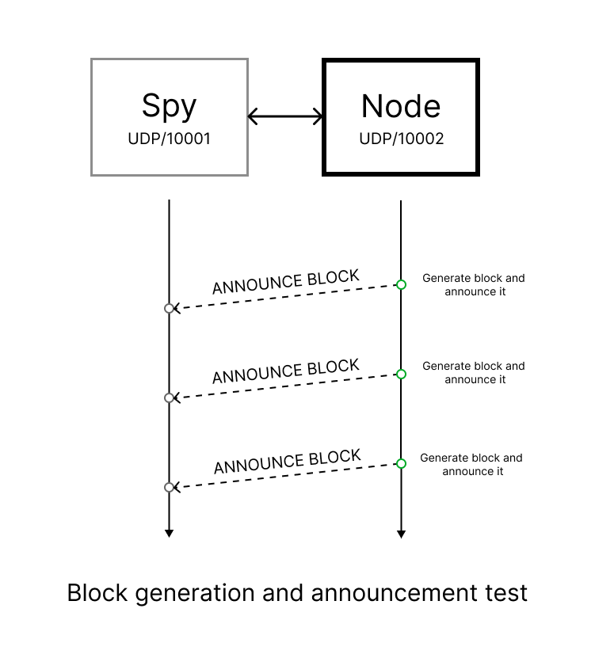
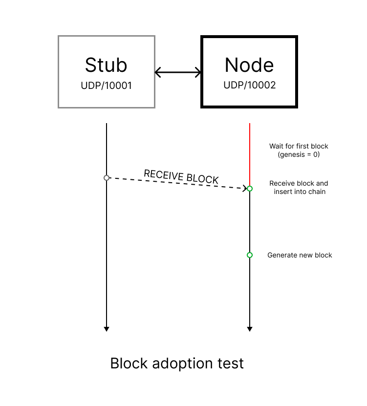
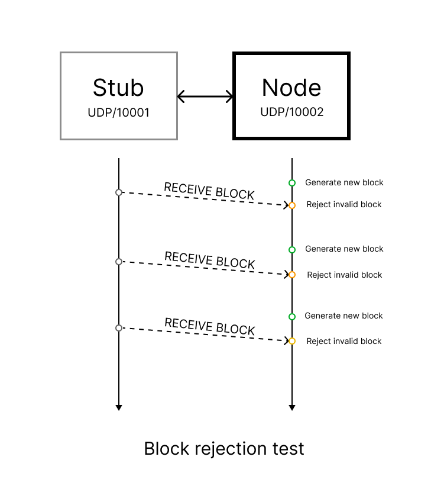
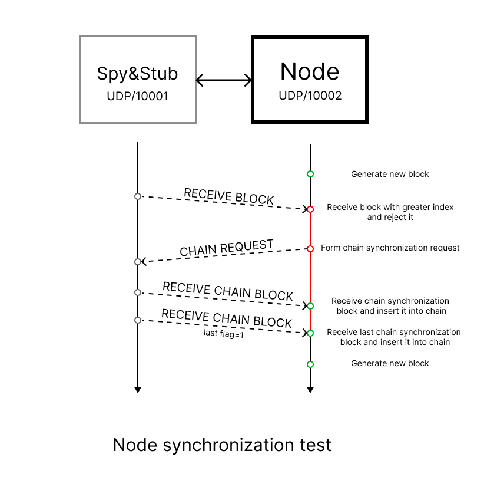
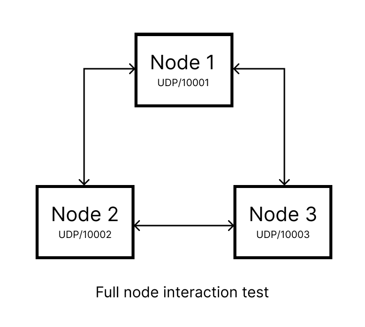

# Blockchain project

main: 
develop: 

Данный проект - реализация блокчейн-сети из трех узлов на языке Python. Для организации сетевого взаимодействия между узлами используются UDP-сокеты.

## Блокчейн

Блокчейн -- это распределённая база данных, где каждый участник может хранить, просматривать, проверять но не удалять данные. Все данные разбиваются на блоки, и каждый блок имеет односвязную связность с предыдущими блоками, позволяющую верифицировать эти блоки. Верификацией занимаются как раз узлы, которые и поддерживают работоспособность блокчейна.

Производство блока это простая операция. Нужно сконкатенировать поля index, prev_hash, data и nonce, и результат записать в поле hash. Но результат можно записывать только при условии, что hash заканчивается на определенное чило нулей. Если это не так, то нужно увеличить дополнение (nonce) и снова попробовать вычислить хеш.

## Реализация

Блокчейн-сеть реализована при помощи UDP-сокетов. Каждый узел производит расчет новых блоков для собственной цепочки,
а также прослушивает сообщения от узлов-соседей. При генерации блока узел обязан оповестить об этом своих соседей и 
передать им сгенерированный блок (сообщение типа *ANNOUNCE_BLOCK*). Получив такой блок, узел анализирует его: если этот
блок подходит, то он вставляется в конец цепочки. Иначе он отбрасывается. Однако может произойти ситуация, когда индекс 
пришедшего неудачного блока больше, чем текущая длина цепочки узла. Это означает, что узел отстал от общего прогресса
или "пошел своим путем". В таком случае узел производит синхронизацию (сообщения типа *CHAIN_REQUEST* и 
*SEND_CHAIN_BLOCK*) и затем продолжает работу.

## Docker Compose
Блокчейн-сеть состоит из трех узлов и может быть запущена командой из корневой директории проекта:

    docker-compose up

## Тестирование
Тестирование разделено на три ступени: модульное тестирование, интеграционное тестирование и системное тестирование.

### Модульное тестирование
Реализованы тесты модульного уровня, проверяющие:
* Корректную генерацию блока (корректность рассчитанного хэша, увеличение цепочки блоков)
* Корректное формирование цепочки блоков (соответствие полей предыдущего хэша и хэша для блоков всех цепочки)
* Корректную реакцию узла на ожидание первого блока (отсутствие генерации новых блоков при *genesis* = 0)

### Интеграционное тестирование
Интеграционные тесты позволяют проверить взаимодействие узлов в системе. Были разработаны следующие тесты:
#### Генерация блока и оповещение соседей
Данный тест позволяет проверить передачу сгенерированного узлом блока соседям:

#### Получение блока
Данный тест позволяет проверить получение блока узлом и его вставку в собственную цепочку:

#### Отбрасывание блока
Данный тест позволяет проверить, что отправка сообщения с некорректным блоком приводит к его отбрасыванию:

#### Синхронизация узла
Данный тест позволяет проверить, что при возникновении ситуации Minority, узел 
производит синхронизацию и продолжает работу:

#### Полное взаимодействие узлов
Данный тест позволяет проверить работу системы из трёх узлов. Запускается работа узлов на некоторый промежуток времени,
затем сверяются цепочки блоков, полученные каждым узлом:

### Системное тестирование
Реализован тест системного уровня, проверяющий закрытие всех использованных сокетов после окончания работы блокчейн-сети.

Тесты модульного и интеграционного уровня запущены на разных платформах (Linux, Windows, macOS)